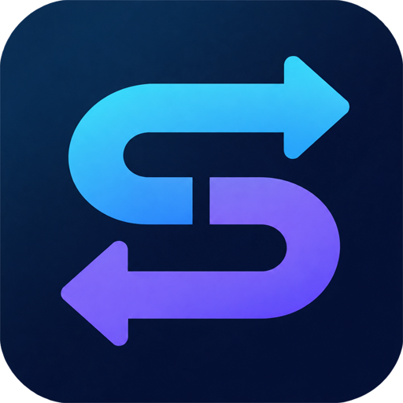

  

<h1 align="center">AiSwitch</h1>

  <b>面向现代 AI 编程辅助工具的一站式渠道接管与智能调度管家</b> 
  为 Codex、Claude Code、Claude Desktop、Antigravity 等主流开发工具提供一键直连与第三方中转无缝切换

  
  
  

---

## 🌟 为什么选择 AiSwitch？

在日常使用现代 AI 辅助编程客户端（如 Codex、Claude Code、Antigravity）时，开发者常面临繁琐的手工配置修改、中转渠道 API 协议兼容性差、官方模型列表被覆盖甚至多模态限制等诸多痛点。

**AiSwitch** 为解决这些问题而生：
- 🚀 **全主流客户端一键热切**：无需手动修改各软件复杂的配置文件，告别因配置格式错误引发的软件崩溃。
- ⚡ **Codex 深度模型注入**：内置动态二进制探针与远期时间戳机制，彻底突破第三方中转站模型在 Codex 官方界面无法显示或自动回退的问题。
- 🎨 **Antigravity 全模态放行**：内置轻量原生语言服务适配引擎，解除多模态图片、截图与 PDF 上传限制，突破账号模型可用性封锁。
- 🍎 **双平台原生级体验**：
  - **macOS**：自适应苹果原生左上角红黄绿三色交通灯控件、苹方与 SF Pro 字体渲染栈与极简胶囊滚动条；
  - **Windows**：支持免管理员提权（UAC）安装与绿色便携版即开即用。
- 🔄 **在线自动静默更新**：客户端内置 GitHub 镜像加速在线检测，发现新版本一键平滑下载升级。

---

## 🖥️ 支持的 AI 客户端与工具

| 客户端 | 适用场景 | 核心支持特性 |
| :--- | :--- | :--- |
| **OpenAI Codex** | VS Code / 桌面端插件 | 协议规范归一化、远期防过期缓存、动态散列探针注入第三方全量模型目录 |
| **Google Antigravity** | 桌面端应用 | 动态端点接管、CSRF 实时重写、全模态媒体放行自愈 |
| **Claude Code** | 终端命令行交互 | 环境变量与全局配置自动化同步、进程安全重载 |
| **Claude Desktop** | 官方桌面端 | 渠道配置、Model 与 API Key 一键平滑切换 |
| **MiniMax Code** | 代码辅助工具 | 原生中转协议快速切换与模型映射 |
| **ZCode** | 智能辅助环境 | 极速切换模型与自建/第三方端点调度 |

---

## 📥 软件下载与安装

你可以前往 [**Releases 发布页面**](https://github.com/wfb927/AiSwitch/releases/latest) 下载最新的安装包：

### Windows 用户
- **标准安装版（推荐）**：[`AiSwitch_0.1.3_x64-setup.exe`](https://github.com/wfb927/AiSwitch/releases/latest/download/AiSwitch_0.1.3_x64-setup.exe)
  - 全高清矢量安装向导，免 UAC 提权提示，支持开机自启与平滑覆盖更新。
- **企业部署包（MSI）**：[`AiSwitch_0.1.3_x64_zh-CN.msi`](https://github.com/wfb927/AiSwitch/releases/latest/download/AiSwitch_0.1.3_x64_zh-CN.msi)
  - 适合 IT 域控管理员进行组策略（GPO）批量分发与静默安装。

### macOS 用户
- **苹果通用安装镜像（DMG 推荐）**：[`AiSwitch_0.1.3_universal.dmg`](https://github.com/wfb927/AiSwitch/releases/latest/download/AiSwitch_0.1.3_universal.dmg)
  - 完美适配 Apple Silicon (M1/M2/M3/M4) 与 Intel 芯片，双击挂载拖拽至 Applications 即可运行。
- **免安装应用归档**：[`AiSwitch_universal.app.tar.gz`](https://github.com/wfb927/AiSwitch/releases/latest/download/AiSwitch_universal.app.tar.gz)

---

## 💡 使用步骤

1. **下载并启动**：打开 AiSwitch 客户端。
2. **选择目标客户端**：顶栏下拉菜单中点击你需要调度的 AI 工具（如 Codex、Claude Code、Antigravity）。
3. **配置中转渠道**：添加你的 API Base URL、API Key 与需要的模型。
4. **一键应用生效**：点击“应用配置”，AiSwitch 会自动完成底层配置注入与自愈对接，直接打开对应的 AI 客户端即可畅享稳定中转加速！

---

## 💬 问题反馈与交流

如果您在使用过程中遇到任何问题或有功能改进建议，欢迎通过 GitHub 提交反馈：
- 提交 Bug 或需求建议：[Issues](https://github.com/wfb927/AiSwitch/issues)

---

  © 2026 AiSwitch Team. All rights reserved.

